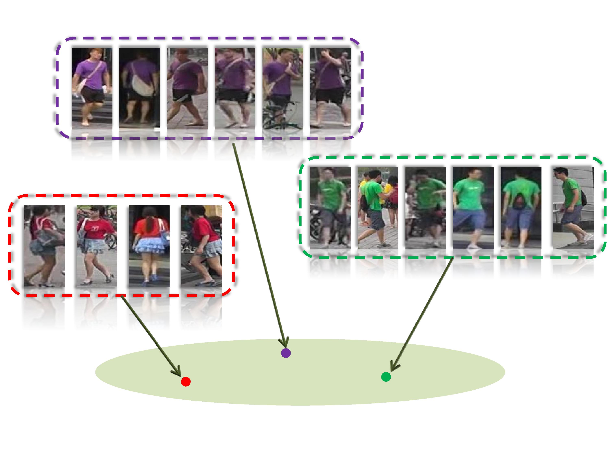
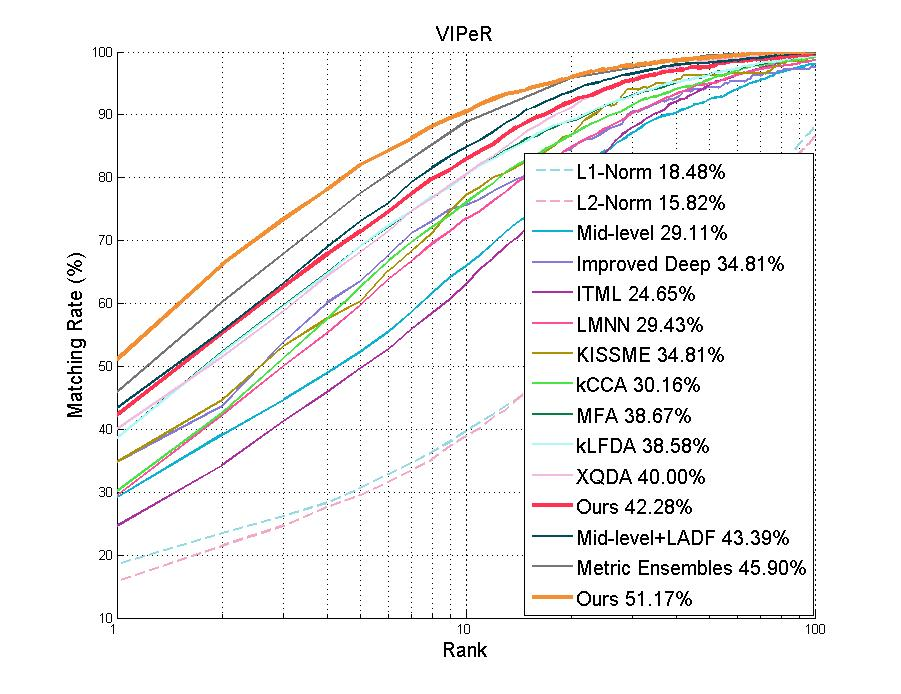
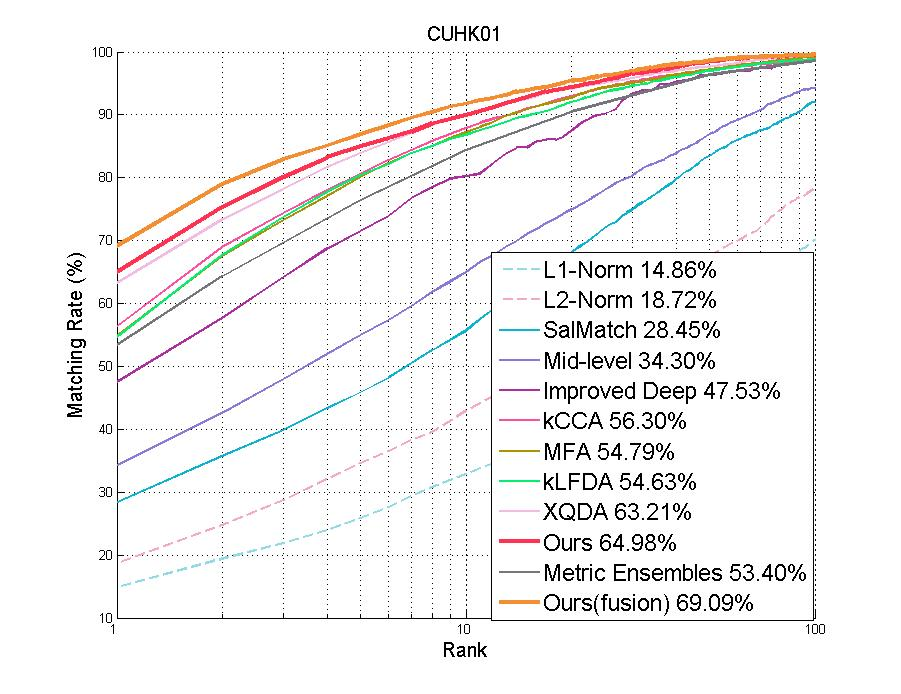

# Discriminative Null Space for Person Re-ID
Demo code for CVPR 2016 paper:  [Learning a Discriminative Null Space for Person Re-identification](http://openaccess.thecvf.com/content_cvpr_2016/papers/Zhang_Learning_a_Discriminative_CVPR_2016_paper.pdf)

[Li Zhang](http://www.robots.ox.ac.uk/~lz/)



# Data
Download data from [here](http://www.robots.ox.ac.uk/~lz/DNS_cvpr2016/data.zip) and unzip it `unzip data.zip`.
  
It contains the [LOMO feature](http://www.cbsr.ia.ac.cn/users/scliao/projects/lomo_xqda/index.html) [1] and [kCCA feature](https://github.com/glisanti/KCCAReId) [2] for VIPeR datasets.

# Run
run `demo.m` in Matlab.

# Results

We used the VIPeR data split provided by [2] in https://github.com/glisanti/KCCAReId.

For LOMO feature, we can get reported result **42.28%** on VIPeR. (RBF kernel).

For kCCA feature, we can get **46.68%** (CHI2 kernel), **45.92%** (RBF kernel).

We can get reported score-level fusion result **51%** on VIPeR. 

# CMC curve

Download the CMC curve on VIPeR, PRID, CUHK01, CUHK03 and Market1501 from [here](http://www.robots.ox.ac.uk/~lz/DNS_cvpr2016/cmc_curve.zip).






## Citing

If you use this code in your research, please use the following BibTeX entry.

```
@inproceedings{zhang2016learning,
  title={Learning a discriminative null space for person re-identification},
  author={Zhang, Li and Xiang, Tao and Gong, Shaogang},
  booktitle={Proceedings of the IEEE Conference on Computer Vision and Pattern Recognition},
  year={2016}
}
```


## References

- [1] [Person Re-identification by Local Maximal Occurrence Representation and Metric Learning](https://www.cv-foundation.org/openaccess/content_cvpr_2015/papers/Liao_Person_Re-Identification_by_2015_CVPR_paper.pdf).
  Shengcai Liao, Yang Hu, Xiangyu Zhu, and Stan Z. Li.
  IEEE Conference on Computer Vision and Pattern Recognition (CVPR), 2015.
- [2] [Matching people across camera views using kernel canonical correlation analysis](https://dl.acm.org/citation.cfm?id=2659036).
  Giuseppe Lisanti, Iacopo Masi, and Alberto Del Bimbo.
  International Conference on Distributed Smart Cameras (ICDSC), 2014.
- [3] [Kernel Null Space Methods for Novelty Detection](https://www.cv-foundation.org/openaccess/content_cvpr_2013/papers/Bodesheim_Kernel_Null_Space_2013_CVPR_paper.pdf).
  Paul Bodesheim, Alexander Freytag, Erik Rodner, Michael Kemmler, and Joachim Denzler.
  IEEE Conference on Computer Vision and Pattern Recognition (CVPR), 2013.
